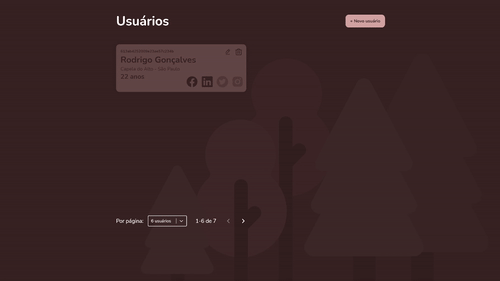

## Demo



https://desafio-d1.vercel.app

## Run Locally

Clone the project

```bash
  git clone https://github.com/Oosasukel/Desafio-D1-Frontend
```

Go to the project directory

```bash
  cd Desafio-D1-Frontend
```

Install dependencies

```bash
  yarn
```

Start the server

```bash
  yarn dev
```
